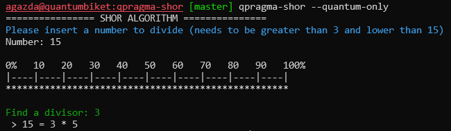

# Implementation of Shor Algorithm using Q-Pragma
This repository provides an implementation of Shor Algorithm based on the **Q-Pragma** framework. This project requires **Q-Pragma** framework and
**Qaptiva PybindLinalg** emulator to be compiled and executed.

## Compilation
The project should be configured with `cmake`, by using the following command:

```bash
export INSTALL_DIR=...  # To be defined
cmake -Wno-dev -Bbuild -DCMAKE_INSTALL_PREFIX:PATH=${INSTALL_DIR} -DCMAKE_EXPORT_COMPILE_COMMANDS=ON -DCMAKE_BUILD_TYPE=release
```

Then, the project can be compiled using `make`

```bash
make -j5        # Compilation using 5 processes - can be changed
make install    # Installation
```

## Execution
Now, the Shor algorithm can be executed using the `qpragma-shor` command (if your `${INSTALL_DIR}` is in your `${PATH}`).
The Shor algorithm can find a solution classically, solution found classically can be ignored by using the `--quantum-only` option. The
`qpragma-shor` command usage is:

```text
Shor algorithm implemented using Q-Pragma:
  -h [ --help ]          Display help
  -q [ --quantum-only ]  Ignore cases where the algorithm finds a solution
                         classically
```

> This usage can be computed using `qpragma-shor --help` command.

**Example of Shor:**

